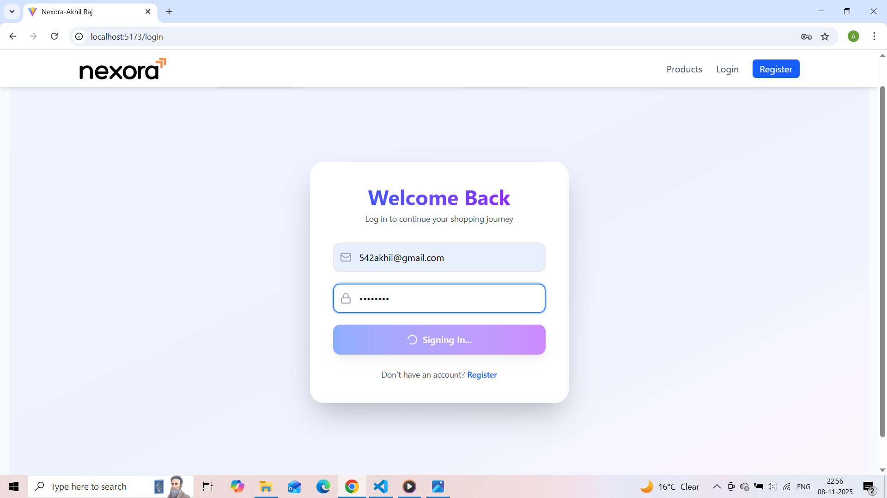
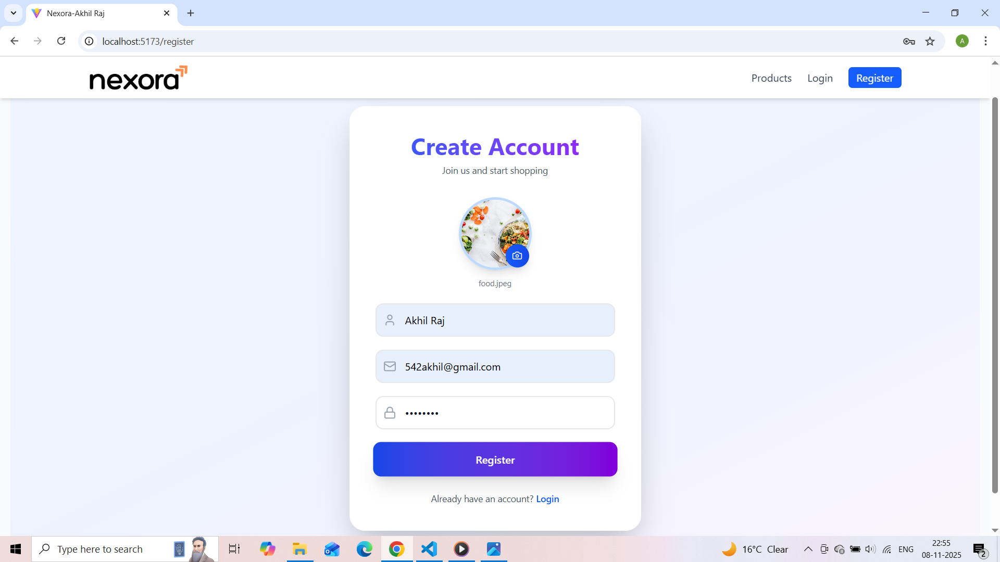
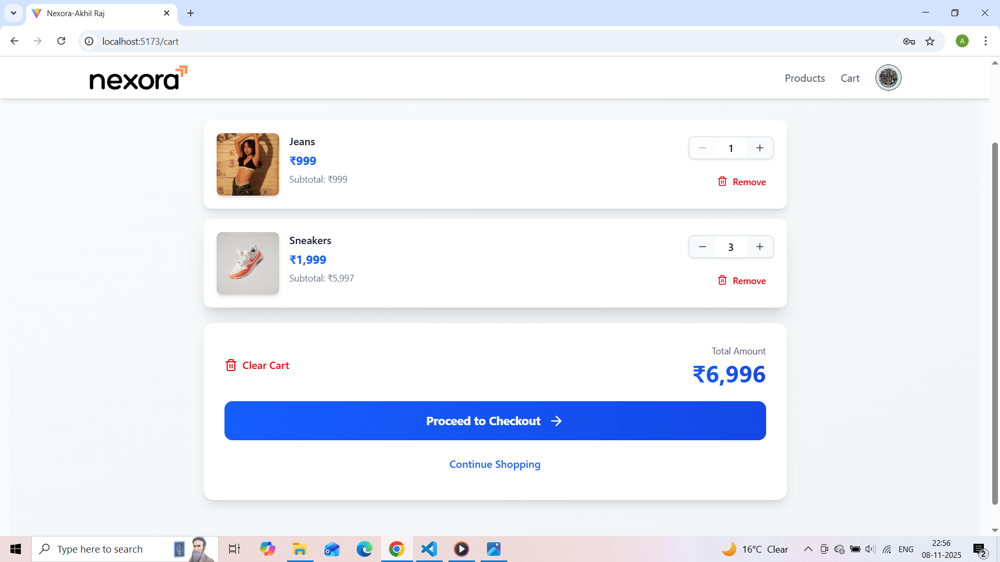

# 🛒 Nexora E-Commerce Cart - Full Stack Assignment

> A complete full-stack e-commerce shopping cart application built for Vibe Commerce internship screening.

## 🎯 Assignment Overview

Built a production-ready shopping cart system with user authentication, product management, cart operations, and mock checkout functionality.

## ✨ Features Implemented

### Core Requirements ✅
- **Product Catalog**: Browse 10 mock products with images and prices
- **Shopping Cart**: Add, remove, and update product quantities
- **Cart Management**: Real-time total calculation and cart persistence
- **Mock Checkout**: Generate order receipts with timestamps
- **Responsive Design**: Works seamlessly on desktop, tablet, and mobile

### Bonus Features 🚀
- **User Authentication**: JWT-based register/login/logout with refresh tokens
- **Avatar Upload**: Cloudinary integration for profile pictures
- **Database Persistence**: MongoDB with user-specific carts
- **Error Handling**: Comprehensive validation and error messages
- **Protected Routes**: Secure cart and checkout endpoints
- **Auto Token Refresh**: Seamless authentication experience

## 🛠️ Tech Stack

**Frontend**: React 18 + Vite + TailwindCSS + React Router  
**Backend**: Node.js + Express + MongoDB + Mongoose  
**Authentication**: JWT (Access + Refresh Tokens) + bcrypt  
**File Upload**: Multer + Cloudinary  
**API Testing**: Postman

## 📁 Project Structure
```
nexora-ecommerce-assignment/
├── client/          # React frontend
├── server/          # Express backend
├── assets/          # Project screenshots
└── README.md        # This file
```

## 🚀 Quick Start

### Prerequisites
- Node.js (v18+)
- MongoDB (local or Atlas)
- Cloudinary account (for avatars)

### Installation
```bash
# Clone repository
git clone https://github.com/Akhil-Raj59/nexora-ecommerce-assignment.git
cd nexora-ecommerce-assignment

# Install backend dependencies
cd server
npm install

# Install frontend dependencies
cd ../client
npm install
```

### Configuration

Create `.env` in `/server`:
```env
PORT=8000
MONGODB_URI=your_mongodb_uri
ACCESS_TOKEN_SECRET=your_secret_key
REFRESH_TOKEN_SECRET=your_refresh_secret
CLOUDINARY_CLOUD_NAME=your_cloud_name
CLOUDINARY_API_KEY=your_api_key
CLOUDINARY_API_SECRET=your_api_secret
```

### Run Application
```bash
# Terminal 1: Start backend (from /server)
npm run dev

# Terminal 2: Start frontend (from /client)
npm run dev
```

**Access**: http://localhost:5173

## 📸 Screenshots

### 1. Login & Registration


*User authentication with JWT tokens and avatar upload*

### 2. Products Grid

*Browse 10 products with responsive grid layout*

### 3. Shopping Cart

*Manage items with quantity controls and real-time total*

### 4. Checkout Process

*User-friendly checkout form with validation*

### 5. Order Receipt

*Mock order confirmation with order ID and timestamp*

## 🎥 Demo Video

**[📹 Watch 2-Minute Demo on YouTube](https://youtu.be/buhGubsC09k?si=qJHMjMO7QLAaGqkP)**

Complete walkthrough showcasing:
- User registration & login flow
- Product browsing & cart operations
- Checkout process & receipt generation
- Responsive design demonstration

## 🔗 API Documentation

See [`/server/README.md`](./server/README.md) for complete API reference.

**Core Endpoints:**
- `GET /api/products` - Fetch all products
- `POST /api/cart` - Add item to cart
- `GET /api/cart` - Get cart with total
- `DELETE /api/cart/:id` - Remove item
- `POST /api/checkout` - Process checkout

**Bonus Auth Endpoints:**
- `POST /api/v1/users/register` - User registration
- `POST /api/v1/users/login` - User login
- `POST /api/v1/users/logout` - User logout
- `POST /api/v1/users/refresh-token` - Token refresh

## 🏗️ Architecture Highlights

- **RESTful APIs** with proper HTTP methods and status codes
- **MVC Pattern** with controllers, models, and routes separation
- **JWT Authentication** with access and refresh token mechanism
- **Middleware** for auth verification and file uploads
- **Error Handling** with custom ApiError and ApiResponse classes
- **Database Relations** with user-cart associations

## 📦 Deliverables Checklist

- ✅ Full-stack application with React + Node.js
- ✅ All 5 core APIs implemented
- ✅ Responsive UI with cart operations
- ✅ Mock checkout with receipt generation
- ✅ Database persistence (MongoDB)
- ✅ Bonus: User authentication system
- ✅ GitHub repository with clean structure
- ✅ Comprehensive README with setup instructions
- ✅ Demo video (YouTube)

## 👨‍💻 Developer

**Akhil Raj**  
📧 Email: 532akhil@gmail.com  
🔗 GitHub: [@Akhil-Raj59](https://github.com/Akhil-Raj59)  
💼 Repository: [nexora-ecommerce-assignment](https://github.com/Akhil-Raj59/nexora-ecommerce-assignment)

---

**Built with ❤️ for Nexora Commerce Internship Assignment**